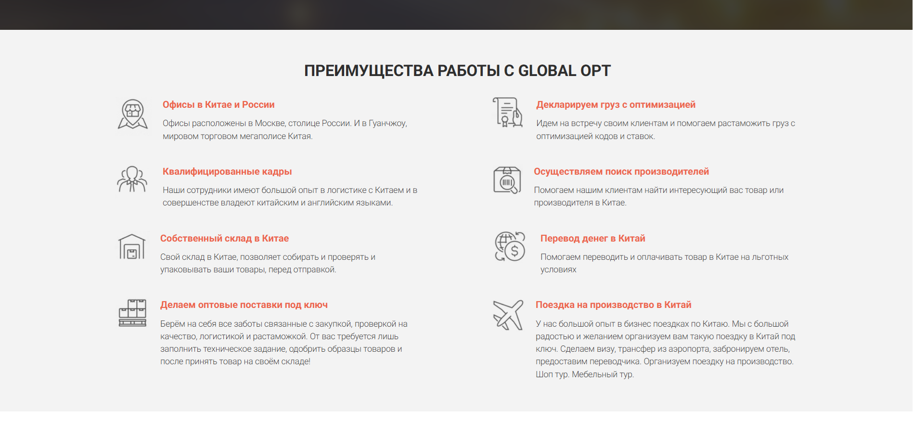
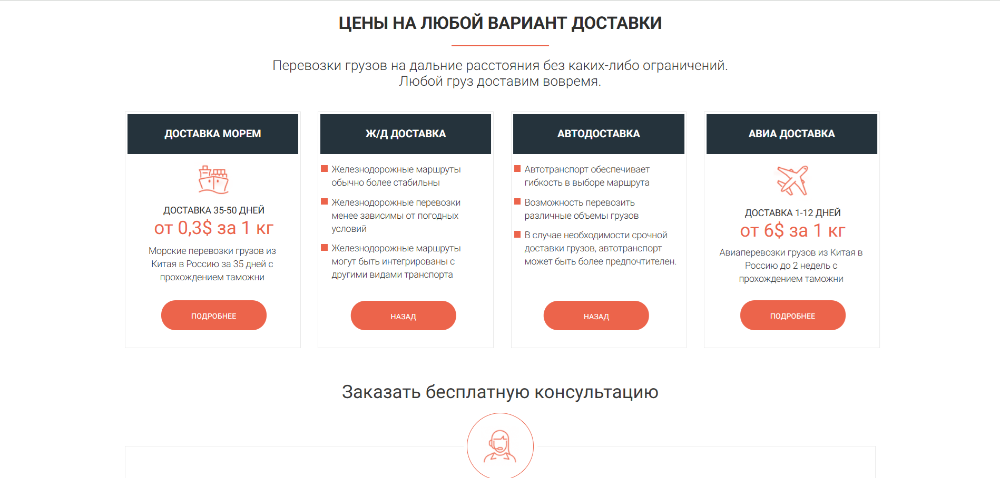
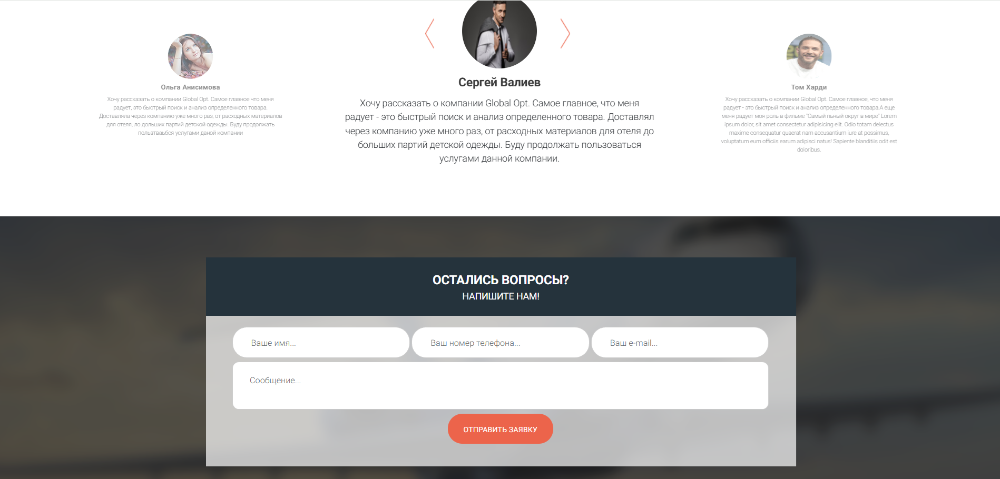
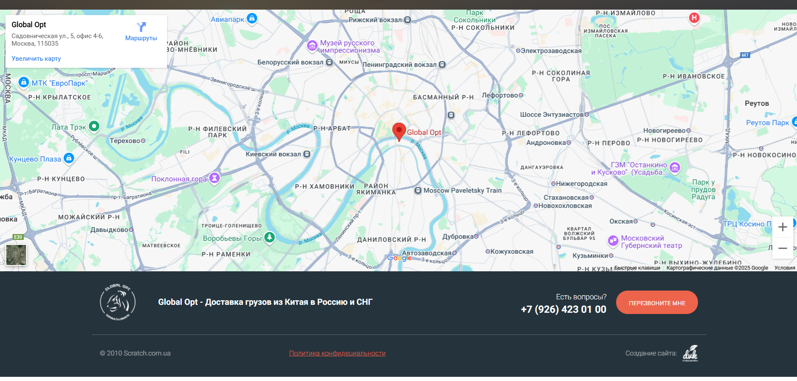
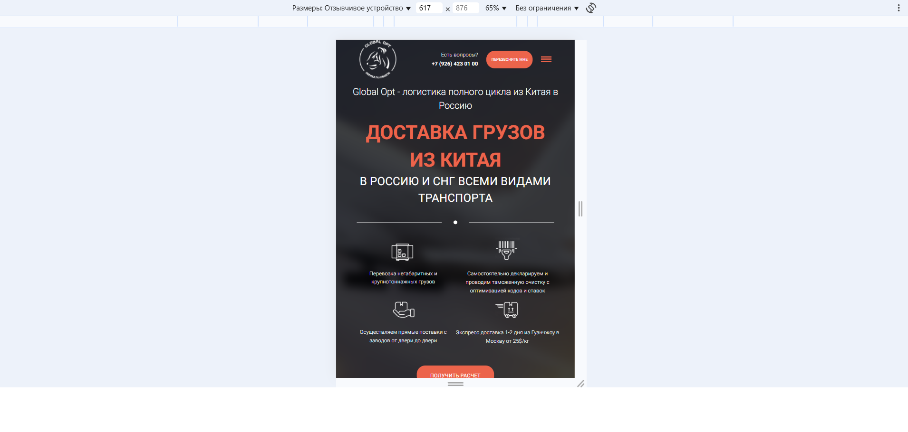
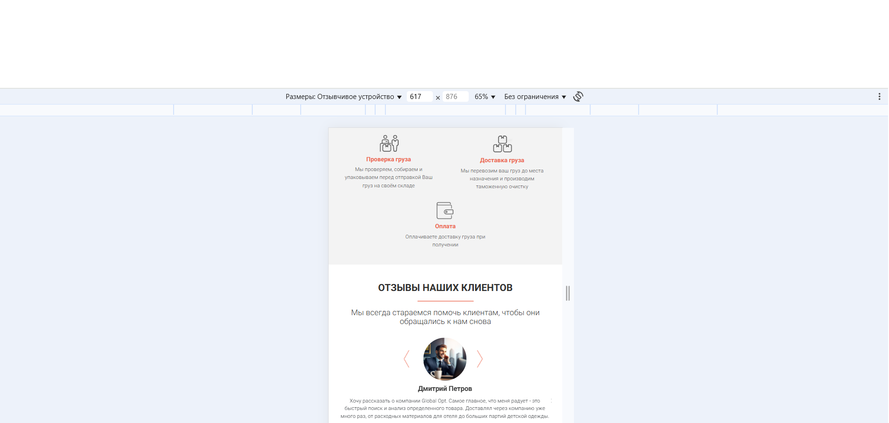

# Структура проекта

**Основные каталоги:**

```
.
├── dist/
│   ├── css/
│   ├── icons/
│   │   ├── advantages/
│   │   ├── carousel/
│   │   ├── china/
│   │   ├── contacts/
│   │   ├── favicon/
│   │   ├── job/
│   │   ├── manager/
│   │   ├── prices/
│   │   ├── promo/
│   │   └── scheme/
│   ├── img/
│   │   ├── china/
│   │   ├── mmanager/
│   │   ├── promo/
│   │   └── questions/
│   ├── js/
│   ├── mailer/
│   ├── index.html
│   └── policy.html
├── src/
│   ├── icons/
│   │   ├── advantages/
│   │   ├── carousel/
│   │   ├── china/
│   │   ├── contacts/
│   │   ├── favicon/
│   │   ├── job/
│   │   ├── manager/
│   │   ├── prices/
│   │   ├── promo/
│   │   └── scheme/
│   ├── img/
│   │   ├── china/
│   │   ├── manager/
│   │   ├── promo/
│   │   └── questions/
│   ├── js/
│   ├── mailer/
│   ├── sass/
│   │   ├── base/
│   │   ├── blocks/
│   │   └── libs/
│   └── screenshots/
├── gulpfile.json
├── package.json
├── package-lock.json
└── README.md

```

=======

# GlobalOpt (JavaScript + SCSS)










## О проекте

GlobalOpt - сайт компании международных грузоперевозок. На сайте реализован слайдер; данные, которые ввел пользователь в форме, отправятся на адрес электронной почты с помощью smart.php. С помощью media-запросов выполнена адаптация под средние и мобильные устройства. Использован таск-менеджер Gulp.

## Технологии

- JavaScript
- gulp
- SCSS
- php отправка данных с формы на электронную почту
- media-запросы

## Установка и запуск

```bash
git clone https://github.com/NikRNN/GlobalOpt.git
cd GlobalOpt
npm install
gulp
```
